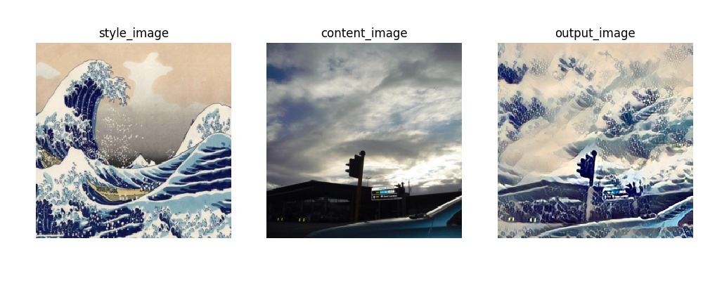
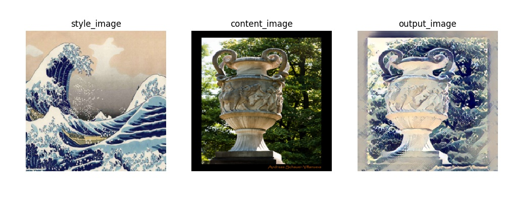
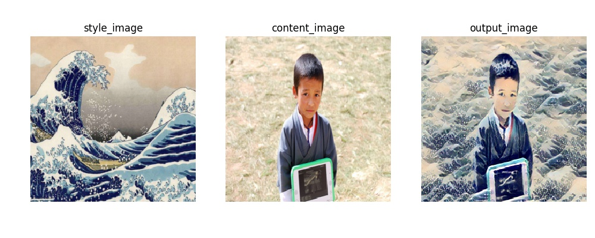

# As Machine Learning Assignment

请查看 `demonstration_trainv1.ipynb` 和 `demonstration_trainv2.ipynb` 查看训练和实际应用的结果。

其他的 `.py` 文件是原在 PyCharm 上编写、训练用的源文件。

 - `trainv1.py` 的训练过程已经完整在 `demonstration_trainv1.ipynb` 中展现。
 
 - `trainv2.py` 需要 coco 数据集完成工作。所以没有在 `demonstration_trainv2.ipynb` 中展现训练过程。`demonstration_trainv2.ipynb` 仅作为训练好的模型 `v2_transnet.pth` 应用在任意图片上的展示。
 
 - `model.py` 存储两个版本所需的 CNN 模型。被 `.ipynb` 文件调用。
 
 - `data_loader.py` 用于加载 coco 数据集的数据。
 
 - `utility.py` 包含共用的功能函数。被 `.ipynb` 文件调用。

 - `v2_transnet.pth` 为 v2 使用 “神奈川冲浪里” 作为风格图片训练而成的图形转换网络参数。

# Image Stylization

Main contributor: [Haolin Jia](https://github.com/Harrypotterrrr)

**Note:** Please head to his [stylization repo](https://github.com/Harrypotterrrr/Image-stylization) for more details.

Image stylization is to combine the actual content from one image and the perceptual context (style) of another image to generate a stylized image.

This project is implementations of [A Neural Algorithm of Artistic Style](https://arxiv.org/abs/1508.06576) and [Perceptual Losses for Real-Time Style Transfer and Super-Resolution](https://arxiv.org/abs/1603.08155). The second implementation used [COCO2014](http://cocodataset.org/#download).

### Introduction

The core idea of the first implementation is to interpret the internal features of a object recognition CNN as the **content features** and the *relation* between them as the **style features**. Thus, the generation of the target image is updating it as parameters, taking content and style loss into consideration. Mind the tradeoff between the two losses. To stress it again, all trainable parameters contains only the pixel value of final output image.

In the second implementation, trainable parameters become the parameters of a image transformation net. Trained net will transform arbitrary images without need of repeated training as in the first implementation.

### Result

#### First implementation

<table>
    <tr>
        <td></td>
        <td></td>
        <td></td>
    </tr>
</table>

#### Second implementation

Training for 1 epoch of 32000 images in batch size of 4 costs around 2 hours and 40 minutes on one K80(12GB) GPU.

### Reference

- [A Neural Algorithm of Artistic Style](https://arxiv.org/abs/1508.06576)
- [Image Style Transfer Using Convolutional Neural Networks](https://www.cv-foundation.org/openaccess/content_cvpr_2016/papers/Gatys_Image_Style_Transfer_CVPR_2016_paper.pdf)
- [Instance Normalization, The Missing Ingredient for Fast Stylization](https://arxiv.org/pdf/1607.08022)
- [Meta Networks for Neural Style Transfer](http://openaccess.thecvf.com/content_cvpr_2018/papers/Shen_Neural_Style_Transfer_CVPR_2018_paper.pdf)
- [Perceptual Losses for Real-Time Style Transfer and Super-Resolution](https://arxiv.org/abs/1603.08155)

